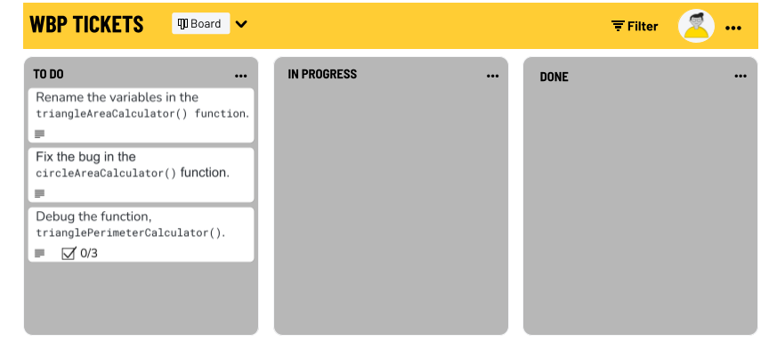

# Intro to Javascript


You are an intern at a math education company. Your team is developing a series of geometry calculators that run in a browser. Your fellow intern has written a draft of these calculators, but their manager has rejected their pull request for a combination of code style and logical errors.

Can you find the bugs and code style issues and fix them for your coworker?

---


- Rename the variables in the `triangleAreaCalculator()` 
- Change the `circleAreaCalculator()` function so that it stops throwing an error.
- Debug the `trianglePerimeterCalculator()` 

---




---


### Preparation Steps
Please concentrate your efforts within the "src" folder, as it will serve as your designated working directory for this exercise. It is important to note that no changes need to be made to any files within the util folder in order to successfully complete the task.

- Fork and clone [this](https://git.generalassemb.ly/SEI-Standard-Curriculum/M1L2-intro-to-javascript-wbp) repository.
- Navigate  `cd`  into the directory.
- Run the following command: `npm i`. This command installs testing dependencies needed to verify your work
- Run tests in the terminal using the command: `npm run test`
- Expect tests to fail on first run, before changes are made. Confirm that all tests are passing to complete the module.

---
### Step 1

- Navigate to `/src/triangleAreaCalculator.js`

- This function calculates the area of a triangle, given the base and height. It works correctly, but was rejected by your manager due to poorly named variables.
- Can you rename the variables in this function so that a developer who had never seen this code before would still understand it?

---
### Step 2

- Navigate to `/src/circleCalculator.js`

- Inside this file, there is a function that calculates the area of a circle, given the radius. The math is correct, but nothing seems to happen when you click submit.
- Open your developer console, then try using the Circle Area Calculator in the web app. What do you see in the console?
- Using your knowledge of `let` and `const`, can you change this file so that the function stops throwing the error?

---
### Step 3

- Navigate to `/src/trianglePerimeterCalculator.js`

- In this file, there is a function that returns the perimeter of a triangle, given three side lengths. Try using the calculator with a variety of different values. Does the math look correct?
- Let's try a few debugging ideas:
  - To start, we can try using `console.log()` to print the value of `sideOneLength`, `sideTwoLength`, and `sideThreeLength`. Once you have added the `console.log()` statements, try the calculator in your browser again and check the console. Do these values look correct?
  - Instead of printing the values of the variables, let's try printing their types. Remember, you can print a variable's type using the `typeof` operator like this: `console.log(typeof ___)`
- Is there a method you can use to fix this problem so that the math works correctly? If you can't remember the method's name, check the last section of today's lesson.
- Once you have used the method on each variable, recheck the calculator in the browser. Does the math look correct this time?

---
### Step 4

Now that you have made the changes requested by your manager, we can run a simple automated test.

- To run the automated tests, run ```npm run test```.
- The tests will run the functions you've modified, and ensure they return the correct values.
- If any of the tests are marked as ```failed```, you can scroll up through your console history to see an explanation of which functions need further fixes.
- If all the tests are marked as ```passed```, then you have successfully completed the exercise.

_Solution code is available in the util folder, should you find yourself stuck._